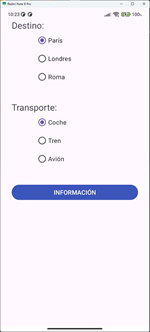

# Me voy de viaje

Esta es una app Android sencilla que permite mostrar un mensaje según las opciones seleccionadas.

## 📱 Interfaz de Usuario (UI)

- **Padding general:** Todos los componentes están a 30dp hacia el interior.
- `TextView` con texto "Destino:" y tamaño de fuente 20sp.
- **Grupo de botones de destino:**
    - `RadioButton` con texto "París" (Opción por defecto). 
    - `RadioButton` con texto "Londres".
    - `RadioButton` con texto "Roma".
- **Grupo de botones de transporte:**
    - `RadioButton` con texto "Coche" (Opción por defecto).
    - `RadioButton` con texto "Tren".
    - `RadioButton` con texto "Avión".
- **Botón INFO:**
    - Texto "INFORMACIÓN".
    - Fondo azul claro.

## ⚙️ Funcionalidad

- Al pulsar el botón **INFO**, se muestra un mensaje con el destino y el transporte seleccionado.

## 🛠️ Tecnologías usadas

- Android Studio
- Java
- XML (para layouts)
- API mínima: 28+ (Android 8.1)

## 📂 Estructura del proyecto

```
/app/src/main/java/.../MainActivity.java (funcionalidad básica)
/app/src/main/res/layout/activity_main.xml
README.md
```

## 📸 Capturas de pantalla

### Pantalla principal



### Resultado de una operación


### Error en la operación


## 📄 Licencia

Este proyecto es de uso educativo y puede modificarse libremente.